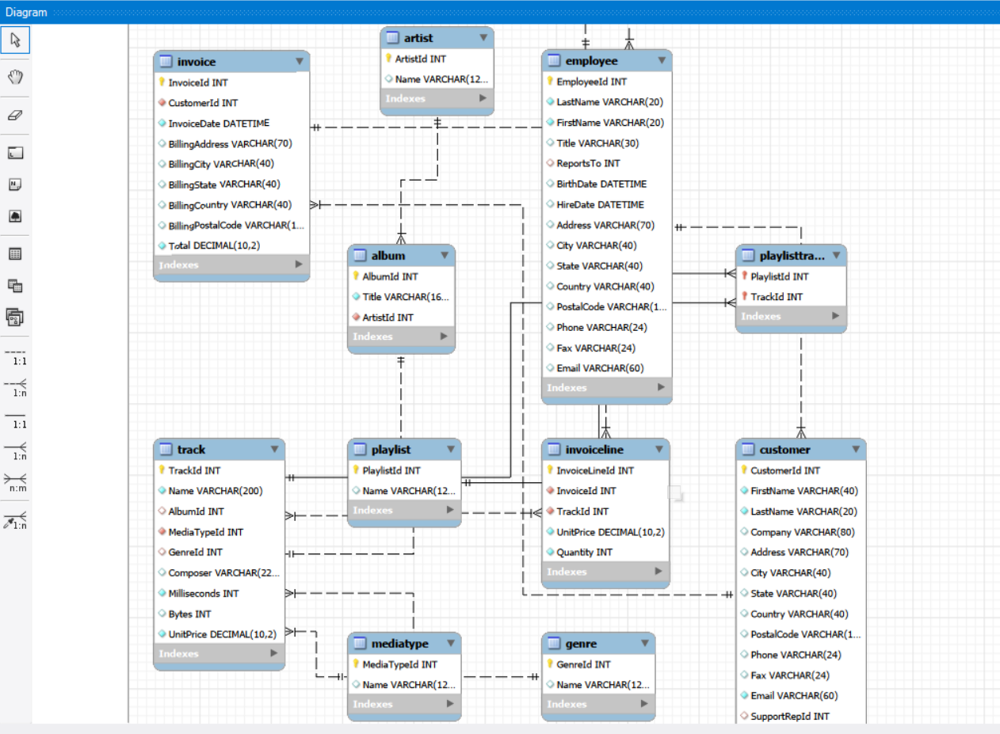

# SQL Practice — Chinook Database

Practiced SQL joins, aggregation, self-joins, and filtering 
using the Chinook sample music store database.

**Concepts covered:** Multi-table joins, GROUP BY + HAVING, 
self-joins (employee hierarchy), aggregate functions.

**Tools:** MySQL Workbench

